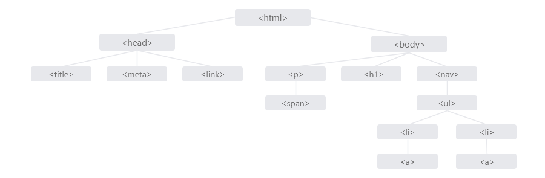

## Дикларация (DOCTYPE)
**С чего начинается HTML-документ?**

Любой HTML-документ начинается с дикларации (типа документа еще его называют доктайп).
Тип документа нужен, чтобы браузер мог определить версию HTML и правильно отобразить страницу. Доктайп помещают в самый вверх страницы (далее вы увидите в примерах). Доктайп который показан ниже обозначает на данный момент последнюю версию HTML ее так же называют HTML5. Эта версия уже принята как стандарт и распространена почти везде, поэтому мы будем использовать именно дикларацию **HTML5**.
```html
<!DOCTYPE html>
```
**Что будет если не указывать дикларацию?**

Если не указывать дикларацию то браузер перейдет в **режим совместимости**. Этот режим предназначен для отображения веб-страницы подобно старым браузерам. В режиме совместимости игнорируются стандарты HTML и CSS, и поведение браузеров становится непредсказуемым. Для переключения в режим совместимости существует множество доктайпов, вот лишь некоторые из них.
```html
<!DOCTYPE HTML PUBLIC "-//W3C//DTD HTML 4.0 Transitional//EN">

<!DOCTYPE HTML PUBLIC "-//W3C//DTD HTML 4.0 Frameset//EN">

<!DOCTYPE HTML PUBLIC "-//W3C//DTD HTML 4.01 Transitional//EN">

<!DOCTYPE HTML PUBLIC "-//W3C//DTD HTML 4.01 Frameset//EN">
```
_Подробнее про **режимы браузеров** и **дикларации** вы можете найти в интернете._ 

## Содержимое HTML документа
**Во что заключено содержимое HTML-документа?**

Содержимое веб-страницы заключено в `<html>` тег который в свою очередь является контейнером для всего содержимого страницы. Поскольку он содержит все элементы в документе он не может содержаться ни в каком другом элементе. 
Его можно использовать как для **HTML**, так и для **XHTML-документов**.

Элементы, находящиеся внутри тега `<html>`, образуют дерево документа, так называемую **объектную модель документа, DOM (document object model)**.

_Ниже изображена простая структура **HTML-документа**._



Как вы уже поняли по изображению внутри элемент `<html>` состоит из двух разделов, так называемых **раздел заголовка** (head) и **раздел тела** (body).

**Что это за разделы такие? Давайте разберем!**


Тег `<html>` включает в себя такие теги как `<head>` и `<body>`.

**Что это за теги?**

Тег `<head>` его цель заключаеться в том чтоб помогать браузеру в работе с данными. 

Что я подразумеваю:
* возможность указания заголовка страницы;
* кодировку страницы;
* имя автора документа;
* описание страницы;
* список ключевых слов, встречающихся на web-странице;

и другое.

> Содержимое `<head>` не отображается напрямую на веб-странице, за исключением элемента `<title>`, он задаёт заголовок окна веб-страницы.

Коммент
